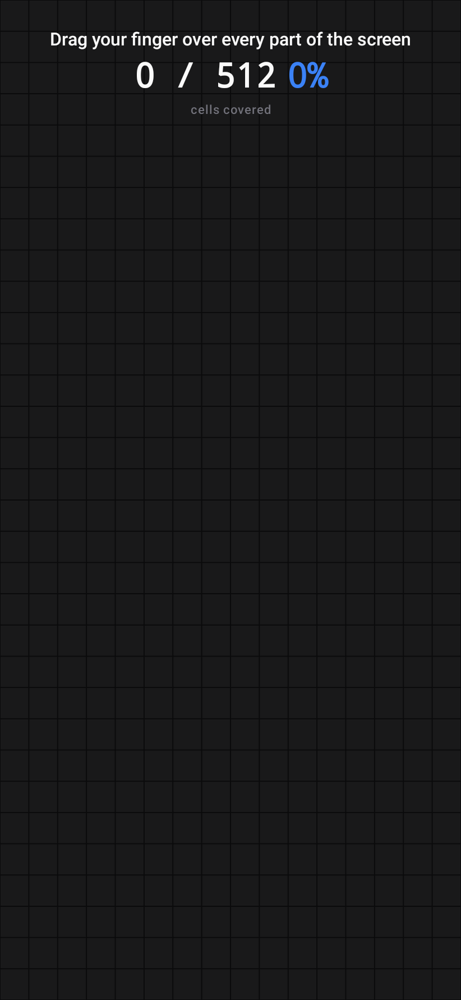
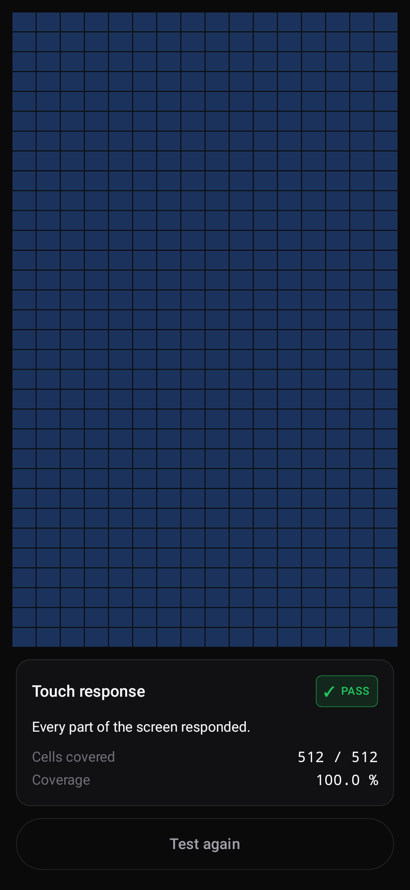

# PhoneProof

An inspection tool for the person **buying** a used phone.

India's second-hand phone market is roughly $6 billion and about 85% of it is unorganised —
person-to-person deals with no warranty and no verification. Every app in the category today
serves either a phone enthusiast browsing specs, or the platform that wants to buy your handset
cheaply. Nobody serves the buyer standing in front of a stranger with ₹18,000 in hand and three
minutes to decide.

That is the gap this fills.

## What makes it different

- **Measures, never looks up.** Every value is read from the device at runtime. No static
  per-model spec table is ever the source of truth, because those go stale and produce confident
  nonsense.
- **Never a bare failure.** A negative result must state the real-world consequence, the action to
  take, and the honest reasons it could be wrong. This is enforced by the `CheckResult`
  constructor, not by convention.
- **`CAN'T TELL` is a respectable answer.** Battery state of health is privileged on Android and
  IMEI has been unreadable by third-party apps since Android 10. Saying so beats inventing a
  number.
- **Fully offline.** You will be in a market lane or a shop basement with no signal.

## Status

Early. One check is implemented end to end: **touch coverage**, which maps the screen into a grid
and finds contiguous unresponsive patches.

The remaining v1 checks are specified but not yet built: EMI/device-admin lock detection, claimed
vs measured hardware, real storage size and speed, security patch age, dead pixel and burn-in
patterns, measured battery discharge with cycle count, sensor inventory, camera/mic/speaker with
waveform analysis, IMEI capture with checksum and CEIR deep link, and a coached physical
walkthrough.

## Screens

Rendered straight from the code, not mockups. See [`screenshots/`](screenshots/).

| | |
|---|---|
|  |  |
|  |  |

## Building

```bash
export ANDROID_HOME=/path/to/android-sdk
./gradlew assembleDebug        # APK
./gradlew test                 # unit tests
./gradlew recordRoborazziDebug # re-render every screen to screenshots/
```

Requires JDK 17. Gradle 8.14.5 comes via the wrapper.

## How this repo is set up, and why

The screenshots are **committed on purpose**. Roborazzi renders Compose on the JVM through
Robolectric, so any screen can be reviewed as a PNG on GitHub without building or installing
anything. CI fails if a UI change lands without its screenshot being updated — a screen that
nobody looked at has not been reviewed.

Module layout:

```
app/                thin: activity, application, navigation wiring
core/model/         PURE KOTLIN — no Android imports, ever
core/designsystem/  theme, tokens, shared components
checks/<name>/      PURE KOTLIN measurement and decision logic
feature/<name>/     Compose UI for one screen
```

`core/model` and `checks/*` use the Kotlin JVM plugin rather than the Android library plugin.
That is load-bearing: it turns an accidental Android import into a compile error, and it keeps the
logic that decides whether someone walks away from a purchase testable in milliseconds.

Project conventions live in [`.kiro/steering/`](.kiro/steering/) — product rules, design tokens,
Android standards, the verification contract, and the Play policy constraints that shaped the
feature set.

## Monetisation

The core is never rationed. Every check, unlimited, free, forever.

| Tier | |
|---|---|
| Free | all checks, 2 saved reports, minimal ads, PDF export via opt-in rewarded ad |
| Premium | ₹99 one-time — no ads, unlimited history, PDF export, comparison |
| Shop | ₹999/year — shop branding on the report card, bulk export |

Ads are forbidden on the battery test, the touch grid, the screen patterns and the report card.
For the first three that is a correctness constraint rather than taste: an ad is uncontrolled CPU,
network and screen load, and it would corrupt the app's own measurements or swallow the touches it
is trying to record.
