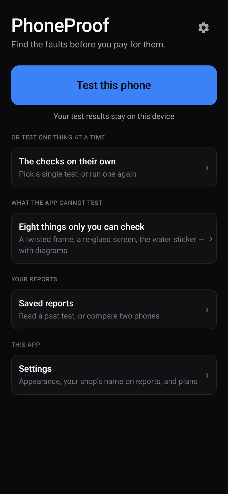
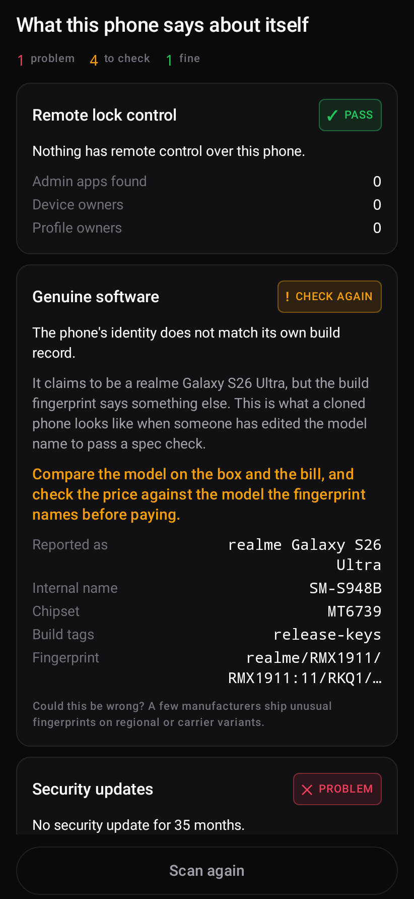
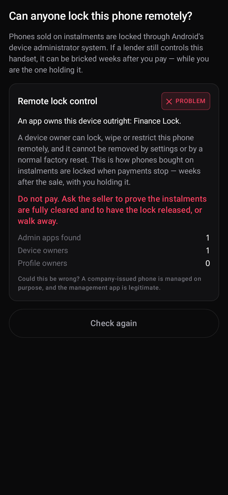
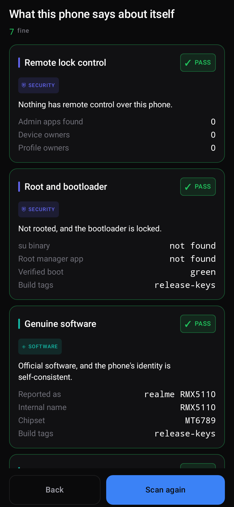
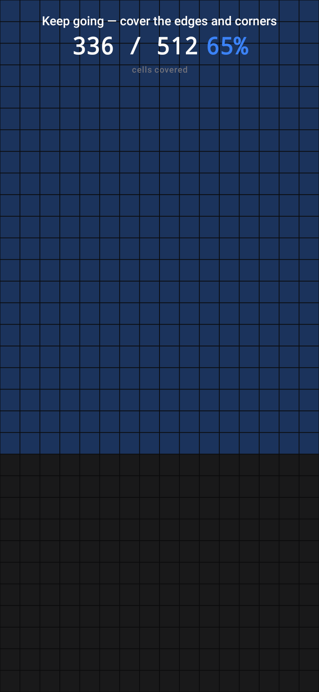
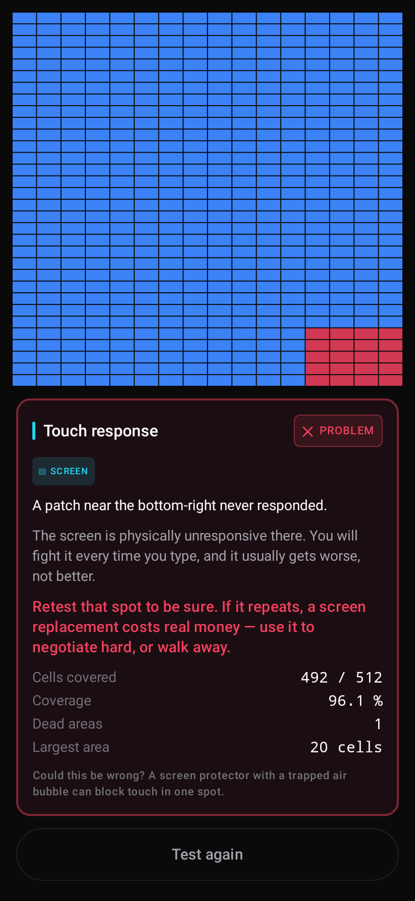
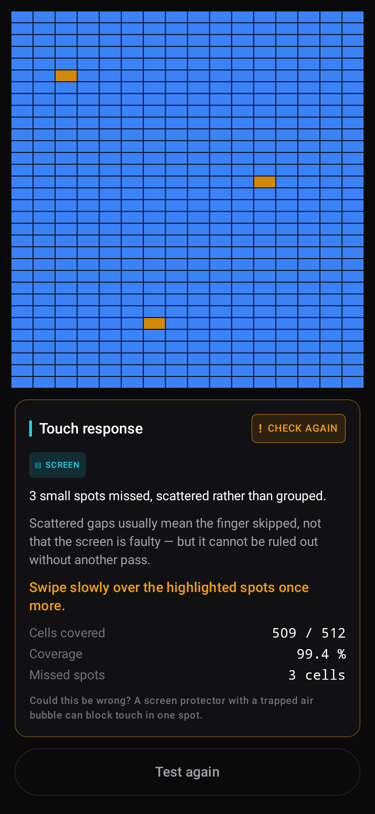
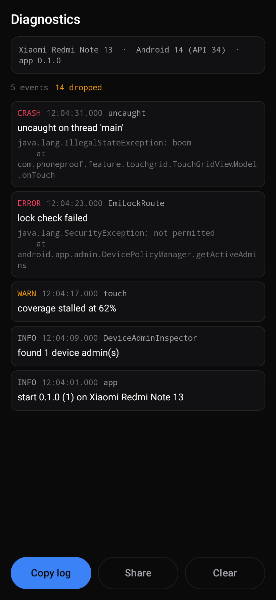

# PhoneProof

An inspection tool for the person **buying** a used phone.

India's second-hand phone market is roughly $6 billion and about 85% of it is unorganised —
person-to-person deals with no warranty and no verification. Every app in the category today
serves either a phone enthusiast browsing specs, or the platform that wants to buy your handset
cheaply. Nobody serves the buyer standing in front of a stranger with ₹18,000 in hand and three
minutes to decide.

That is the gap this fills.

## What makes it different

- **Measures, never looks up.** Every value is read from the device at runtime. No static
  per-model spec table is ever the source of truth, because those go stale and produce confident
  nonsense.
- **Never a bare failure.** A negative result must state the real-world consequence, the action to
  take, and the honest reasons it could be wrong. This is enforced by the `CheckResult`
  constructor, not by convention.
- **`CAN'T TELL` is a respectable answer.** Battery state of health is privileged on Android and
  IMEI has been unreadable by third-party apps since Android 10. Saying so beats inventing a
  number.
- **Fully offline.** You will be in a market lane or a shop basement with no signal.

## Status

Eight checks run as one **instant scan** — no permission prompt, nothing for the buyer to do, done in
under a second:

| Check | What it catches |
|---|---|
| **Remote lock control** | Device-owner or device-admin control: how a phone bought on instalments gets bricked weeks after you pay |
| **Root and bootloader** | An `su` binary, a root manager, or a Verified Boot state that is not `green` — a phone whose own measurements cannot be trusted, and which banking apps will eventually refuse |
| **Genuine software** | `test-keys` builds, and a `Build.FINGERPRINT` that disagrees with the model name — what a cloned handset looks like |
| **Security updates** | Months since the last patch, from `Build.VERSION.SECURITY_PATCH` |
| **Storage** | Usable capacity against the tier it is sold as, catching downgraded chips |
| **Sensors** | A missing gyroscope or proximity sensor: invisible in a spec argument, checkable in a second |
| **Display** | Real resolution and the highest refresh rate the panel supports, versus the rate it is running at |
| **Battery** | Charge cycles from the fuel gauge, which survive a factory reset, plus charge, temperature and voltage. Wear is never a `FAIL`, and no health percentage is ever invented |

Then, one thing at a time:

- **Touch coverage** maps the screen into a grid and finds contiguous unresponsive patches, counting
  only the cells Android does not reserve for its own edge gestures.
- **Dead pixels and burn-in** drives the panel through plain colours at forced maximum brightness.
- **Claimed against measured** puts what the seller said beside what the phone reports.
- **Eight things only you can check** covers the faults no app can reach — a twisted frame, a
  re-glued screen, the water sticker in the SIM slot — each with a diagram of the action.
- **Saved reports** keep past scans and compare two phones side by side.

Plus an in-app **diagnostics log** that captures errors and uncaught exceptions and copies in one
tap — so a bug report is an exact log rather than a remembered symptom.

Still to build: camera, microphone and speaker with waveform analysis, IMEI capture with checksum
and a CEIR deep link, and photo capture during the manual walkthrough.

## Screens

Rendered straight from the code, not mockups. See [`screenshots/`](screenshots/).

| | |
|---|---|
|  |  |
|  |  |
|  |  |
|  |  |

Launcher icon at the sizes it is actually seen at, including the Android 13+ themed variant that
strips colour: [`icon-sizes.png`](screenshots/icon-sizes.png).

## Building

```bash
export ANDROID_HOME=/path/to/android-sdk
./gradlew assembleDebug        # APK
./gradlew test                 # unit tests
./gradlew recordRoborazziDebug # re-render every screen to screenshots/
```

Requires JDK 17. Gradle 8.14.5 comes via the wrapper.

## How this repo is set up, and why

The screenshots are **committed on purpose**. Roborazzi renders Compose on the JVM through
Robolectric, so any screen can be reviewed as a PNG on GitHub without building or installing
anything. CI fails if a UI change lands without its screenshot being updated — a screen that
nobody looked at has not been reviewed.

Module layout:

```
app/                thin: activity, application, navigation wiring
core/model/         PURE KOTLIN — no Android imports, ever
core/designsystem/  theme, tokens, shared components
checks/<name>/      PURE KOTLIN measurement and decision logic
feature/<name>/     Compose UI for one screen
```

`core/model` and `checks/*` use the Kotlin JVM plugin rather than the Android library plugin.
That is load-bearing: it turns an accidental Android import into a compile error, and it keeps the
logic that decides whether someone walks away from a purchase testable in milliseconds.

Project conventions live in [`.kiro/steering/`](.kiro/steering/) — product rules, design tokens,
Android standards, the verification contract, and the Play policy constraints that shaped the
feature set.

## Monetisation

No check is ever watered down to sell an upgrade: every measurement runs in full on the free trial,
at full accuracy. What the trial limits is **how many phones** you can scan — two, and then it stops.

That is a reversal of this project's original position, which was that scanning would be unlimited
and free forever. It was changed deliberately, on the reasoning that a trial which measures
everything forever gives nobody a reason to pay, and it is recorded in
[`.kiro/steering/monetisation.md`](.kiro/steering/monetisation.md) so that it cannot be quietly
reverted by someone reading only this file.

| Tier | Scans | Advice screens | Reports |
|---|---|---|---|
| Free trial | **2, then blocked** | locked | last 2 kept, PDF via opt-in rewarded ad |
| Premium — ₹99 one-time | unlimited | unlocked | all kept, PDF, comparison, no ads |
| Shop — ₹999/year | unlimited | unlocked | everything, plus shop branding on the report card and bulk export |

"Advice screens" means *Claimed against measured* and *Eight things only you can check*. They are
advice and comparison rather than measurements of the phone, which is why they sit behind the trial
while no measurement does.

Ads are forbidden on the battery test, the touch grid, the screen patterns and the report card.
For the first three that is a correctness constraint rather than taste: an ad is uncontrolled CPU,
network and screen load, and it would corrupt the app's own measurements or swallow the touches it
is trying to record.
